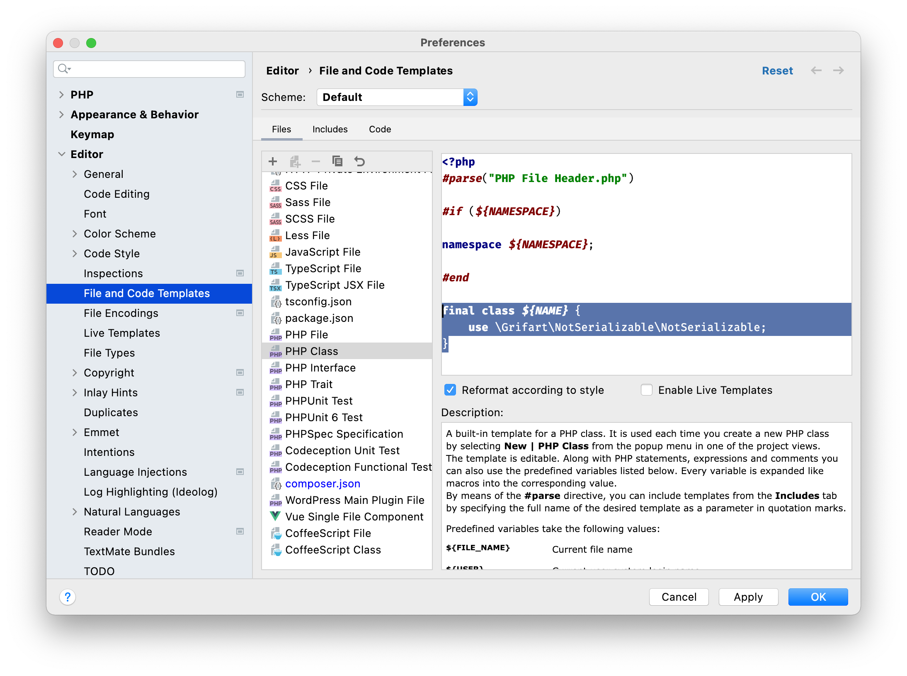

# Not serializable

As every object should be `final` as default. It should NOT be serializable as default.
Unfortunately reality in PHP is different.

If you want to make your classes NOT-serializable, you must explicitly state that.

# Usage

Require this package using composer

```bash
composer require grifart/not-serializable
```

and update your IDE default class template to:

```php
final class ${NAME} {
	use \Grifart\NotSerializable\NotSerializable;
}
```



